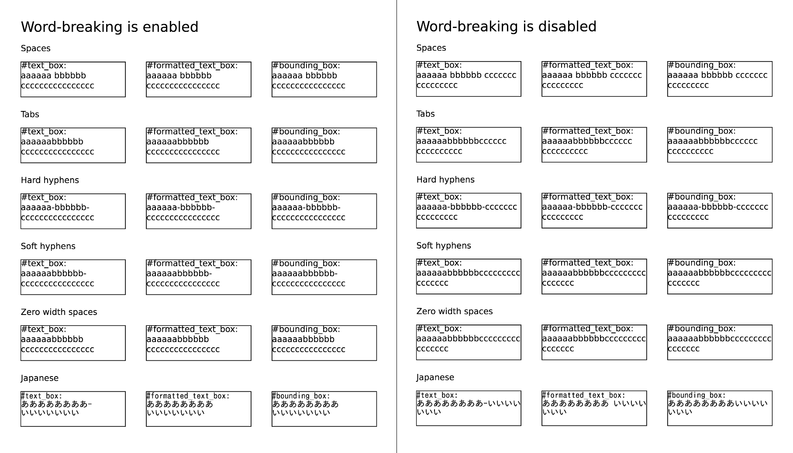

# Prawn::DisableWordBreak

[](https://github.com/hidakatsuya/prawn-disable_word_break/actions)

Prawn::DisableWordBreak is an extension that adds a method to disable word-breaking by character such as space and hyphen to [Prawn](https://github.com/prawnpdf/prawn).



See [feature test](test/features/text_line_wrapping_test.rb) for details.

## Installation

Add this line to your application's Gemfile:

```ruby
gem 'prawn-disable_word_break'
```

And then execute:

    $ bundle install

Or install it yourself as:

    $ gem install prawn-disable_word_break

## Usage

```ruby
require 'prawn/disable_word_break'

Prawn::Document.generate 'foo.pdf' do
  disable_word_break do
    # word-breaking is disabled here
    text_box 'text without word-breaking', at: [100, 100], width: 50, height: 50
  end

  word_break(true) do
    # word-breaking is disabled here
    formatted_box [{ text: 'text without word-breaking' }], at: [100, 100], width: 50, height: 50
  end

  word_break(false) do
    # word-breaking is disabled here
    text_box 'text without word-breaking', at: [100, 100], width: 50, height: 50
  end

  # word-breaking is enabled here
  formatted_box [{ text: 'text with word-breaking' }], at: [100, 100], width: 50, height: 50
end
```

## Supported Versions

### Ruby

2.6, 2.7

### Prawn

2.2+

## Development

To install this gem onto your local machine, run `bundle exec rake install`. To release a new version, update the version number in `version.rb`, and then run `bundle exec rake release`, which will create a git tag for the version, push git commits and tags, and push the `.gem` file to [rubygems.org](https://rubygems.org).

### Testing

This project has two test types, each of which can be run with the following command:

    $ bundle exec rake test:units
    $ bundle exec rake test:features

Or, both tests can be run below:

    $ bundle exec rake test

To run `test:features`, you need [diff-pdf](https://github.com/vslavik/diff-pdf). You can run by installing it or using a Docker container for testing.

Here's how to run `test:features` in the Docker container:

    $ docker build -t prawn-disable_word_break-dev .
    $ docker run -v $PWD:/prawn-disable_word_break:cached -it prawn-disable_word_break-dev bash

    > /prawn-disable_word_break#
    > /prawn-disable_word_break# bundle install
    > /prawn-disable_word_break# bundle exec rake test:features

## Contributing

Bug reports and pull requests are welcome on GitHub at https://github.com/hidakatsuya/prawn-disable_word_break. This project is intended to be a safe, welcoming space for collaboration, and contributors are expected to adhere to the [code of conduct](https://github.com/hidakatsuya/prawn-disable_word_wrap/blob/master/CODE_OF_CONDUCT.md).


## License

(c) 2020 Katsuya HIDAKA. The gem is available as open source under the terms of the [MIT License](https://opensource.org/licenses/MIT). See [LICENSE.txt](https://github.com/hidakatsuya/prawn-disable_word_break/blob/master/LICENSE.txt) for further details.

## Code of Conduct

Everyone interacting in the Prawn::DisableWordBreak project's codebases, issue trackers, chat rooms and mailing lists is expected to follow the [code of conduct](https://github.com/hidakatsuya/prawn-disable_word_break/blob/master/CODE_OF_CONDUCT.md).
